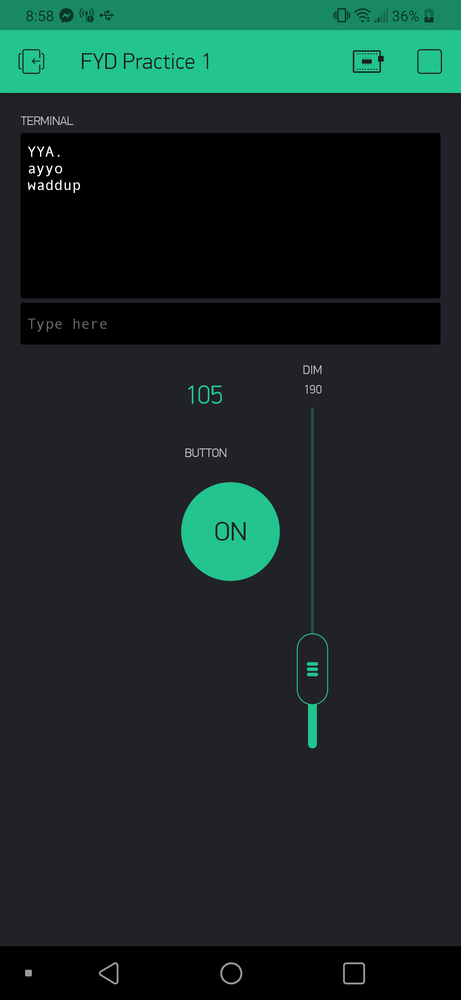

Name: Shaw-Iong Hsueh

EID: sh48926

Team Number:

## Questions

1. What is the purpose of an IP address?

    The IP address identifies who the host, or the network interface, as well as the location of the host in the network. Basically it allows the network to identify the device, and who to send/receive information from.

2. What is a DNS? What are the benefits of using domain names instead of IP addresses?

    A Domain Name Service converts IP address to domain names (like google.com) to its IP address. This allows us to access IP addresses in human readable and more memorable formats than a string of numbers.

3. What is the difference between a static IP and a dynamic IP?

    A static IP doesn't change once it's assigned to a device, whereas a dynamic IP changes over time.

4. What is the tradeoff between UDP and TCP protocols?

    TCP is connection-based and reliable meaning no loss. UDP is connectionless, unreliable, but fast.

5. Why can't we use the delay function with Blynk?

    The delay function messes up the timing the Arduino has with the Blynk app since the Arduino can't do anything while the delay function is running

6. What does it mean for a function to be "Blocking"?

    Blocking means that nothing else can run while something is running, like a delay function.

7. Why are interrupts useful for writing Non-Blocking code?

    Everytime the Arduino senses an input, it is able to immediately deal with that input and whatever function is needed to implement with that input. It allows simultaneous control of multiple things at once. 

8. What is the difference between interface and implementation? Why is it important?

   Interface defines what an object can do, but doesn't actually do it. The implementation is used to determine what the interface does. This is important because it is a level of abstraction that allows the programmer to tell the program to do something without having to know how exactly how the program handles it in the background, as well as preventing the programmer from tinkering with essential background processing. 

9. Screenshot of your Blynk App:

    
